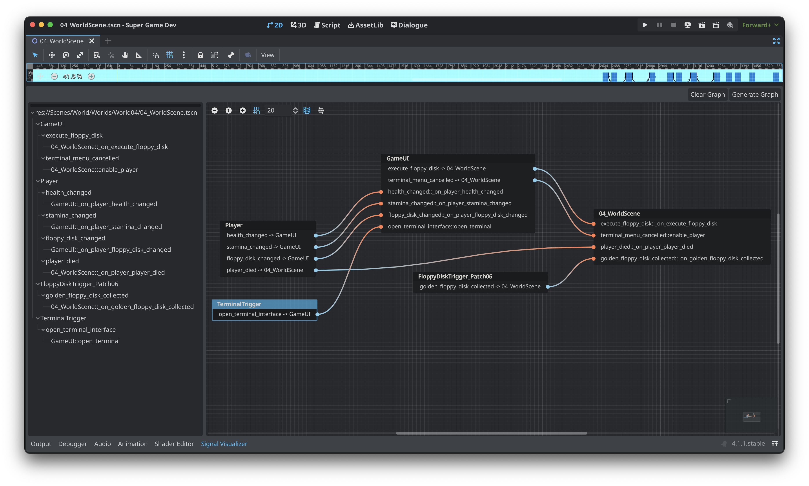
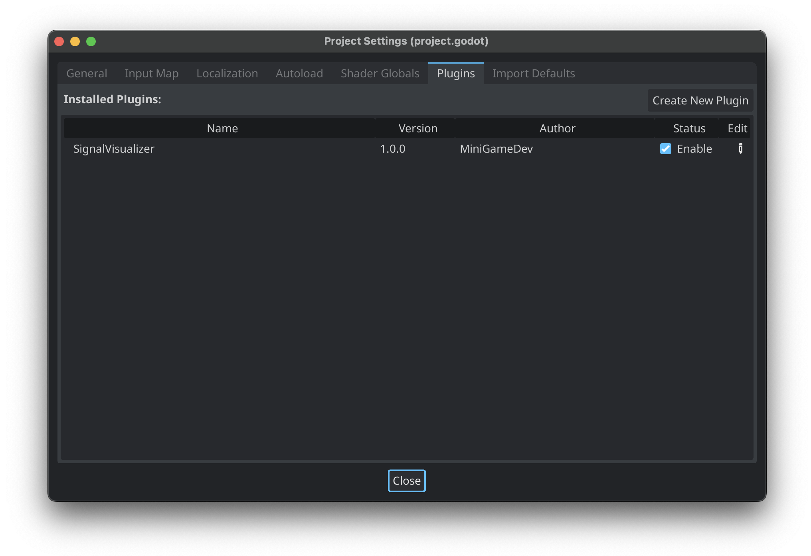
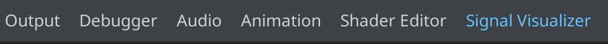
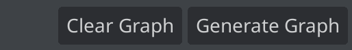
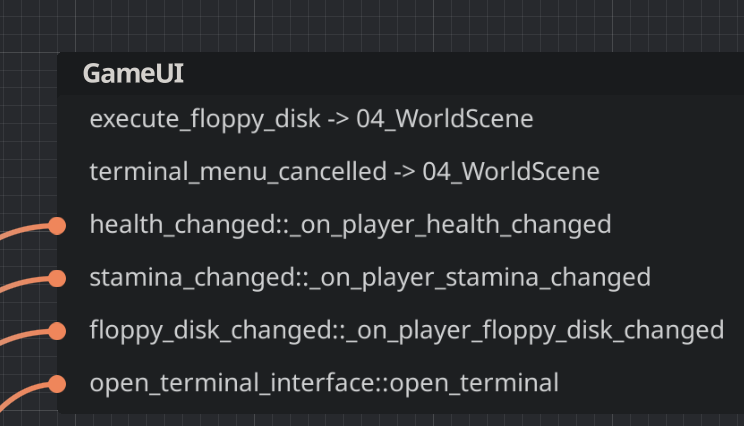
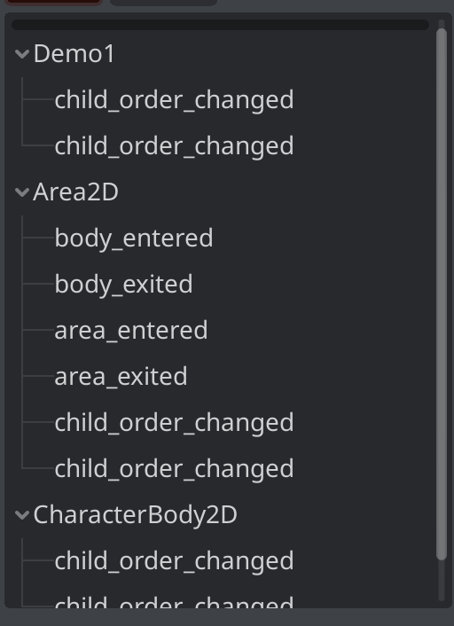
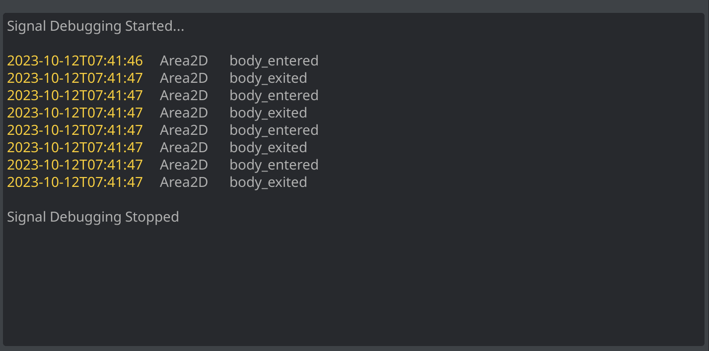
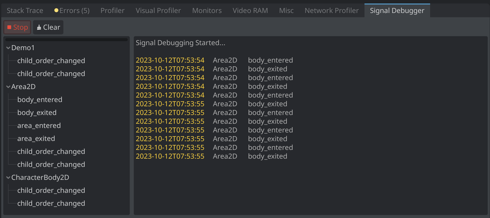

# SignalVisualizer
A plugin for Godot 4.x. SignalVisualizer displays the current scene's signals and connections in a easy to read graph and tree dock.



## YouTube

### Visualization

[](https://www.youtube.com/watch?v=eCWlVX9pwGU)

## Installation

The SignalVisualizer plugin can be installed from source or the Godot Asset Library.

### Godot Asset Library Installation

1. In Godot's AssetLib tab, search for SignalVisualizer
1. Download & Install

[Godot Asset Library: SignalVisualizer](https://godotengine.org/asset-library/asset/2067)

### Installation via Github

1. Download the repo
2. Copy the `addons/SignalVisualizer` directory to your project's `res://addons/` directory.
3. Enable the plugin under Project Settings -> Plugins



4. The `Signal Visualizer` tab will display in the bottom dock region. 



5. The `Signal Debugger` tab will display as a new panel in the Debugger dock.


## Usage

<details>
<summary><h3>Signal Visualizer</h3></summary>

Signal Visualizer will create a signal graph by mapping the signals in the current scene in the Godot editor. The bottom dock uses the built-in `GraphEdit` and `Tree` nodes to display the signal graph. Only signals with the flag of `CONNECT_PERSIST` will be displayed in the signal graph. In addition, all nodes that begin with `@` in the name will be ignored.

1. With your scene open in the editor, open the bottom dock.
2. In Signal Visualizer's top toolbar, click "Generate Graph"



#### Arrange Nodes Toggle

The "Arrange Nodes" toggle enables and disables automatic node arrangement when generating the graph. When enabled, `GraphEdit`'s `arrange_nodes()` function will be called once all graph nodes are generated.

#### Signal Details Toggle

The "Signal Details" toggle enables and disables expanded formatting described below. When disabled, only the signal's name and corresponding function will be displayed in the graph nodes connections.

#### Opening Signals in Source

The "Open" button that displays next to a signal's connected function will open the corresponding source file at the function's line number.

#### Format

In the signal graph and tree, the format is as follows:

##### Outgoing Signal

```
Signal -> Connected Node
```


##### Incoming Signal

```
Signal::Callable Method
```


</details>

<details>
<summary><h3>Signal Debugger</h3></summary>

The Signal Debugger connects to a running scene instance to allow for automatic logging of signals. This alleviates the need to add `print` statements to your own code when debugging signals.

The Signal Debugger panel has two main components. The first is the signal tree. Similar to Signal Visualizer, all relevant scene signals are displayed in the tree.



The second main component is the signal log output. This is the main body of the Signal Debugger panel and contains all log messages for signals that have been triggered in the scene.



With your game scene running, navigate to the Signal Debugger panel under the Debugger dock item. Click the `Start` button to begin signal logging. With the Signal Debugger started, the scene's signal tree will appear and a started message will appear in the signal log output. All relavant signals will log the following:

* Timestamp
* Node that fired the signal
* Signal Name



Clicking `Stop` will stop signal debugging, disconnecting from all relavant signals in the current game scene. Closing the current game scene will disconnect and stop debugging as well.

</details>

## Troubleshooting

If you encounter any of the following issues, please log a bug on the issues tab.

#### Godot Freezes & Crashes

In the event, Godot freezes and crashes when clicking "Generate Graph", please toggle "Arrange Nodes" **off** and try again.
