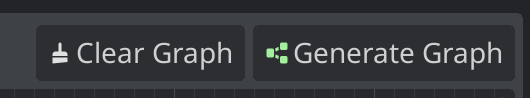

# SignalVisualizer
A plugin for Godot 4.x. SignalVisualizer displays the current scene's signals and connections in a easy to read graph and tree dock.


## Installation

The SignalVisualizer plugin can be installed from source.

### Godot Asset Library Installation

1. In Godot's AssetLib tab, search for SignalVisualizer
1. Download & Install

[Godot Asset Library: SignalVisualizer](https://godotengine.org/asset-library/asset/2067)

### Installation via Github

1. Download the repo
2. Copy the `addons/SignalVisualizer` directory to your project's `res://addons/` directory.
3. Enable the plugin under Project Settings -> Plugins


4. The `Signal Visualizer` tab will display in the bottom dock region. 


## Usage

Signal Visualizer will create a signal graph by mapping the signals in the current scene in the Godot editor. The bottom dock uses the built-in GraphEdit and Tree nodes to display the signal graph. Only signals with the flag of `CONNECT_PERSIST` will be displayed in the signal graph. In addition, all nodes that begin with `@` in the name will be ignored.

1. With your scene open in the editor, open the bottom dock.
2. In Signal Visualizer's top toolbar, click "Generate Graph"



### Arrange Nodes Toggle

The "Arrange Nodes" toggle enables and disables automatic node arrangement when generating the graph. When enabled, `GraphEdit`'s `arrange_nodes()` function will be called once all graph nodes are generated.

### Signal Details Toggle

The "Signal Details" toggle enables and disables expanded formatting described below. When disabled, only the signal's name and corresponding function will be displayed in the graph nodes connections.

### Opening Signals in Source

The "Open" button that displays next to a signal's connected function will open the corresponding source file at the function's line number.

### Format

In the signal graph and tree, the format is as follows:

#### Outgoing Signal

```
Signal -> Connected Node
```


#### Incoming Signal

```
Signal::Callable Method
```


### Troubleshooting

If you encounter any of the following issues, please log a bug on the issues tab.

#### Godot Freezes & Crashes

In the event, Godot freezes and crashes when clicking "Generate Graph", please toggle "Arrange Nodes" **off** and try again.
