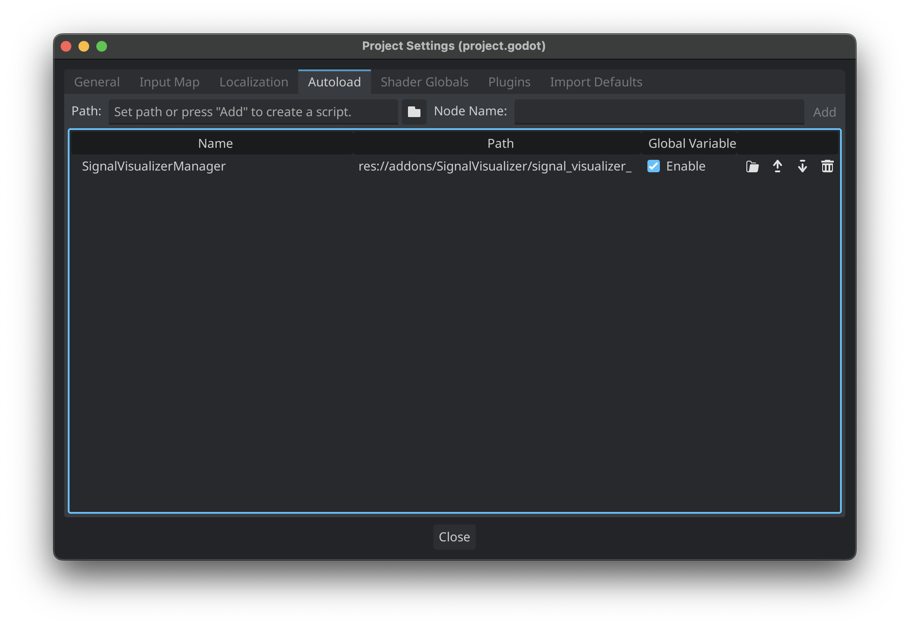

# SignalVisualizer
A plugin for Godot 4.x. SignalVisualizer displays the current scene's signals and connections in a easy to read graph and tree dock.


## Installation

The SignalVisualizer plugin can be installed via Godot's Asset Library or from source.

### Source Installation via Github

1. Download the repo
2. Copy the `addons/SignalVisualizer` directory to your project's `res://addons/` directory.
3. Enable the plugin under Project Settings -> Plugins


4. Ensure the Autoload singleton is enabled. The plugin adds the autoload automatically.



5. The `Signal Visualizer` tab will display in the bottom dock region. 


## Usage

Signal Visualizer will create a signal graph by mapping the signals in the current scene in the Godot editor. The bottom dock uses the built-in GraphEdit and Tree nodes to display the signal graph. Only signals with the flag of `CONNECT_PERSIST` will be displayed in the signal graph. In addition, all nodes that begin with `@` in the name will be ignored.

1. With your scene open in the editor, open the bottom dock.
2. In Signal Visualizer's top toolbar, click "Generate Graph"


### Format

In the signal graph and tree, the format is as follows:

#### Outgoing Signal

```
Signal -> Connected Node
```


#### Incoming Signal

```
Signal::Callable Method
```

